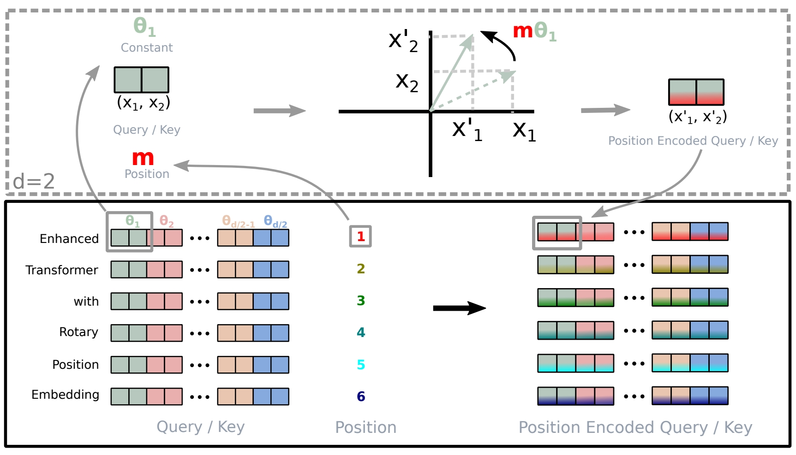

# Position Encoding

**Comments**: Positional encoding is crucial in Transformer architectures because the original model lacks an inherent sense of sequence order.

## Table of Contents

- [Absolute Position Embedding `Learnable` `Absolute`](#1-absolute-position-embedding)
- [Sinusoidal Position Encoding `Fixed` `Absolute`](#2-sinusoidal-position-encoding)
- [Relative Position Encoding `Learnable` `Relative`](#3-relative-position-encoding)
- [Rotary Position Embedding `Fixed` `Relative`](#4-rotary-position-embedding)


## 1. Absolute Position Embedding


**Implementation**

```python
# in the embedding part
import torch
from torch import nn
position_ids = torch.arange(INPUT_LENGTH).unsqueeze(0)
position_embedding = nn.Embedding(MAX_POSITION, HIDDEN_SIZE)
position_embedding = position_embedding(position_id)
# Then add into word embedding
```

**References**

> - Devlin, Jacob et al. “BERT: Pre-training of Deep Bidirectional Transformers for Language Understanding.” North American Chapter of the Association for Computational Linguistics (2019).
> - Liu, Yinhan et al. “RoBERTa: A Robustly Optimized BERT Pretraining Approach.” ArXiv abs/1907.11692 (2019): n. pag.

## 2. Sinusoidal Position Encoding


**Brief Introduction:**
$t$ is the position step, $d$ is the hidden size of the model, $i$ is the dimension of the hidden size

$$
\begin{cases}
PE(t, 2i) &= sin(\frac{t}{10000^{2i/d}}) \\
PE(t, 2i+1) &= cos(\frac{t}{10000^{2i/d}})
\end{cases}
$$

according to the Trigonometric Identities `sin(a±b)=sin(a)cos(b)±cos(a)sin(b)`,`cos(a+b)=cos(a)cos(b)-sin(a)sin(b)`, `cos(a-b)=cos(a)cos(b)+sin(a)sin(b)`

$$
\begin{cases}
PE(t + k, 2i) &= PE(t, 2i) \times PE(k, 2i+1) + PE(t, 2i+1) \times PE(k, 2i)  \\
PE(t + k, 2i+1) &= PE(t, 2i+1) \times PE(k, 2i+1) - PE(t, 2i) \times PE(k, 2i)
\end{cases}
$$

Property1: $PE_{t+k}$ can be represented as linear function of $PE_{t}$, Therefore, $PE_{t}^TPE_{t+k}$ is dependent on $k$, which indicates this kind of position encoding methods have the potentials of applying relative position

let $\theta_i = \frac{1}{10000^{2i/d}}$

$$
PE_{t} = 
\begin{bmatrix}
sin(\theta_0t)\\
cos(\theta_0t)\\
\cdots\\
sin(\theta_{\frac{d}{2}-1}t) \\
cos(\theta_{\frac{d}{2}-1}t)
\end{bmatrix}
$$

Property2:

$$
\begin{align}
PE_{t}^TPE_{t+k} &= \sum_{i=0}^{\frac{d}{2}-1}[sin(\theta_it)sin(\theta_i(t+k)) + cos(\theta_it)cos(\theta_i(t+k))] \\
& = \sum_{i=0}^{\frac{d}{2}-1}cos(\theta_i(t-(t+k))) \\
& = \sum_{i=0}^{\frac{d}{2}-1}cos(\theta_ik)\\
& = PE_{t'}^TPE_{t'+k} \\
& = PE_{t}^TPE_{t-k}
\end{align}
$$

This means that sinusoidal position embeddings are unaware of direction

**Implementation**

```python
import numpy as np
import torch
position_embedding = torch.zeros(MAX_POSITION, HIDDEN_SIZE).unsqueeze(0)
position_enc = np.array([[pos / np.power(10000, 2*(j//2)/HIDDEN_SIZE) for j in range(HIDDEN_SIZE)] for pos in range(MAX_POSITION)])
position_embedding[:, 0::2] = torch.FloatTensor(np.sin(position_enc[:, 0::2]))
position_embedding[:, 1::2] = torch.FloatTensor(np.cos(position_enc[:, 1::2]))
```

**References**

> - Vaswani, Ashish et al. “Attention is All you Need.” Neural Information Processing Systems (2017).
> - Yan, Hang et al. “TENER: Adapting Transformer Encoder for Named Entity Recognition.” ArXiv abs/1911.04474 (2019): n. pag.
> - [The Annotated Transformer
>   ](https://nlp.seas.harvard.edu/2018/04/03/attention.html), HarvardNLP's blog


## 3. Relative Position Encoding


**Comments**: The core of self-attention is dot-product

**Brief Introduction**

- Original Self-Attention

$W^Q, W^K, W^V$ are parameter matrices, the attention score is calculated as $e_{ij}=\frac{(x_iW^Q)(x_jW^K)^T}{\sqrt{d}}$, where $d$ is the hidden size of single head, $x_i$ is the embedding $i^{th}$ token, here is a row vector. So the attention weight is calculated as $\alpha_{ij}=\frac{exp(e_{ij})}{ \sum\limits_{k=1}^{n} exp(e_{ij})}$. The output is $z_i= \sum\limits_{j=1}^{n} \alpha_{ij}(x_jW^V)$.

- Fuse Relative Position Information into Self-Attention

the relative position is actually pair-wise relationship between input elements, represented by vectors $a_{ij}^K, a_{ij}^V$. We first add it into attention score $e_{ij}=\frac{(x_iW^Q)(x_jW^K + a_{ij}^K)^T}{\sqrt{d}}$, then add it into output $z_i= \sum\limits_{j=1}^{n} \alpha_{ij}(x_jW^V + a_{ij}^V)$. In practice, there will be clip operation.

- Transformations

$$
\begin{align}
q_ik_j^T &= ((x_i+p_i)W^Q)((x_j+p_j)W^K)^T \\
&= x_iW^Q{W^K}^Tx_j^T + x_iW^Q{W^K}^Tp_j^T+p_iW^Q{W^K}^Tx_j^T+p_iW^Q{W^K}^Tp_j^T\\
&\approx x_iW^Q{W^K}^Tx_j^T + x_iW^Q{W^K}^TR_{i-j}^T+uW^Q{W^K}^Tx_j^T+vW^Q{W^K}^TR_{i-j}^T\\
&\approx x_iW^Q{W^K}^Tx_j^T + x_iW^Q{W^{K,R}}^TR_{i-j}^T+u{W^K}^Tx_j^T+v{W^{K,R}}^TR_{i-j}^T \quad (XLNet)\\
&\approx x_iW^Q{W^K}^Tx_j^T + x_iW^Q{W^K}^TR_{i,j}^T+R_{j,i}{W^K}^Tx_j^T \quad (DeBERTa)\\
&\approx x_iW^Q{W^K}^Tx_j^T + \beta_{i,j} \quad (T5)\\
\end{align}
$$

**Implementation 1**
```python
# in the attention part (clipping)
import torch
from torch import nn
position_ids_l = torch.arange(QUERY_LENGTH).view(-1, 1)
position_ids_r = torch.arange(KEY_LENGTH).view(-1, 1)
distance = position_ids_l - position_ids_r
distance_embedding = nn.Embedding(2*MAX_POSITION-1, HEAD_SIZE)
position_embedding = distance_embedding(distance + MAX_POSITION - 1) # lrd
relative_position_scores = torch.matmul(QUERY, position_embedding) # bhld @ lrd -> bhlr
attention_scores = attention_scores + relative_position_scores
```

**Implementation 2**
```python
# in attention part (sinusoidal)
import torch
from torch import nn
position_ids = torch.arange(INPUT_LENGTH-1, -1, -1.0)
position_embedding = 1 / (10000 ** (torch.arange(0.0, HIDDEN_SIZE, 2.0) / HIDDEN_SIZE))
position_embedding = torch.outer(position_embedding, position_ids).unsqueeze(1) # l1d
r = nn.Linear(HIDDEN_SIZE, HEAD * HEAD_SIZE, bias=False)
position_embedding = r(position_embedding)
position_embedding = position_embedding.view(INPUT_LENGTH, HEAD, HEAD_SIZE)
relative_position_score = torch.einsum("ibnd,jbnd->bnij", QUERY, position_embedding)
attention_scores = attention_scores + relative_position_score
```

**References**

> - Shaw, Peter et al. “Self-Attention with Relative Position Representations.” North American Chapter of the Association for Computational Linguistics (2018).
> - Dai, Zihang et al. “Transformer-XL: Attentive Language Models beyond a Fixed-Length Context.” ArXiv abs/1901.02860 (2019): n. pag.
> - Yang, Zhilin et al. “XLNet: Generalized Autoregressive Pretraining for Language Understanding.” Neural Information Processing Systems (2019).
> - Raffel, Colin et al. “Exploring the Limits of Transfer Learning with a Unified Text-to-Text Transformer.” J. Mach. Learn. Res. 21 (2019): 140:1-140:67.
> - He, Pengcheng et al. “DeBERTa: Decoding-enhanced BERT with Disentangled Attention.” ArXiv abs/2006.03654 (2020): n. pag.
> - [让研究人员绞尽脑汁的Transformer位置编码](https://spaces.ac.cn/archives/8130), Jianlin Su's blog

## 4. Rotary Position Embedding


**Brief Introduction**
The primary objective of RoPE (Rotary Position Embedding) is to identify an operation that enables the inner product to incorporate relative positional information effectively. i.e. find a solution of the equation $< f(q, m), f(k, n)>=g(q,k,m-n)$
Intuitively, we introduce complex number, let arbitrary $\theta \in (0, \frac{\pi}{2N}]$

$$
\begin{align}
RoPE(x, m) &= xe^{im\theta}\\
< RoPE(q_j,m), RoPE(k_j,n)> &= < q_je^{im\theta}, k_je^{in\theta}>\\
 &=(q_je^{im\theta})(k_je^{in\theta})^* \\
 &=q_jk_je^{i(m-n)\theta}\\
 &=RoPE(q_jk_j, m-n) 
\end{align}
$$

For detailed derivation, please refer to the [original paper](https://arxiv.org/pdf/2104.09864.pdf).

**Implementation**
In a two-dimensional context, a complex number can be represented in the form of a matrix, which geometrically corresponds to a rotation vector

$$
f(q, m) = qe^{im\theta}=
\begin{pmatrix}
\cos m\theta & -\sin m\theta\\ 
\sin m\theta & \cos m\theta
\end{pmatrix}
\begin{pmatrix}
q_0 \\ 
q_1
\end{pmatrix}
$$

the rotary matrix could be a combination of several 2D rotary matrix

$$
\begin{pmatrix} 
\cos m\theta_0 & -\sin m\theta_0 & 0 & 0 & \cdots & 0 & 0 \\ 
\sin m\theta_0 & \cos m\theta_0 & 0 & 0 & \cdots & 0 & 0 \\ 
0 & 0 & \cos m\theta_1 & -\sin m\theta_1 & \cdots & 0 & 0 \\ 
0 & 0 & \sin m\theta_1 & \cos m\theta_1 & \cdots & 0 & 0 \\ 
\vdots & \vdots & \vdots & \vdots & \ddots & \vdots & \vdots \\ 
0 & 0 & 0 & 0 & \cdots & \cos m\theta_{d/2-1} & -\sin m\theta_{d/2-1} \\ 
0 & 0 & 0 & 0 & \cdots & \sin m\theta_{d/2-1} & \cos m\theta_{d/2-1} \\ 
\end{pmatrix} 
\begin{pmatrix}
q_0 \\ 
q_1 \\ 
q_2 \\ 
q_3 \\ 
\vdots \\ 
q_{d-2} \\ 
q_{d-1}
\end{pmatrix}
$$

visualize the implementation

<!--  -->

<center>
  
  <figcaption>implementation of RoPE</figcaption>
</center>

```python
# in the embedding part (apply rotary position to QUERY and KEY)
import numpy as np
import torch
from torch import nn
position_ids = torch.arange(0, KEY_LENGTH)
position_embedding = nn.Embedding(MAX_POSITION, HEAD_SIZE)
position_embedding.weight.requires_grad = False
position_enc = np.array([[pos/np.power(10000, 2*(j//2)/dim) for j in range(dim)] for pos in range(n_pos)])
position_embedding.weight[:, 0::2] = torch.FloatTensor(np.sin(position_enc[:, 0::2]))
position_embedding.weight[:, 1::2] = torch.FloatTensor(np.cos(position_enc[:, 1::2]))
sinusoidal_pos = position_embedding(position_ids)
sin, cos = sinusoidal_pos.chunk(2, dim=-1)
sin_pos = torch.stack([sin, sin], dim=-1).reshape_as(sinusoidal_pos)
cos_pos = torch.stack([cos, cos], dim=-1).reshape_as(sinusoidal_pos)
rotate_half_QUERY = torch.stack([-QUERY[..., 1::2], QUERY[..., ::2]], dim=-1).reshape_as(QUERY)
QUERY = QUERY * cos_pos + rotate_hals_QUERY * sin_pos
rotate_half_KEY = torch.stack([-KEY[..., 1::2], KEY[..., ::2]], dim=-1).reshape_as(KEY)
KEY = KEY * cos_pos + rotate_half_KEY * sin_pos
```

**References**

> - Su, Jianlin et al. “RoFormer: Enhanced Transformer with Rotary Position Embedding.” ArXiv abs/2104.09864 (2021): n. pag.
> - [Transformer升级之路：2、博采众长的旋转式位置编码](https://spaces.ac.cn/archives/8265), Jianlin Su's blog
> - [Rotary Embeddings: A Relative Revolution](https://blog.eleuther.ai/rotary-embeddings/), Eleuther's blog
> - [Positional Encodings I. Main Approaches](https://medium.com/mantisnlp/positional-encodings-i-main-approaches-bd1199d6770d), Medium
