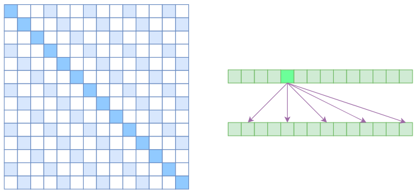
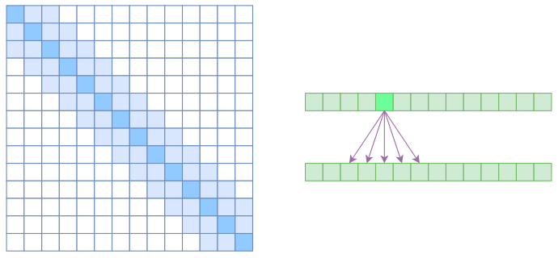
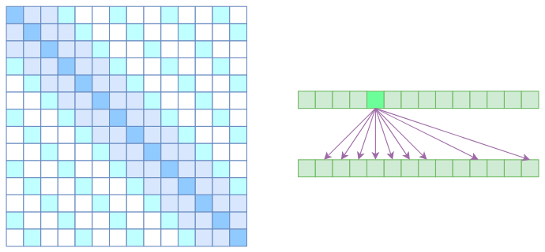
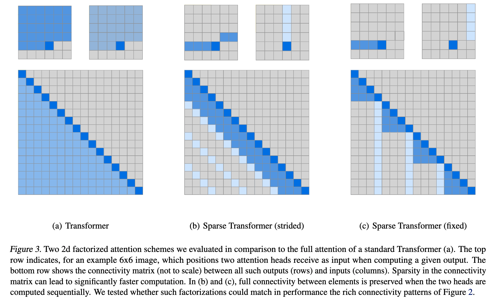

# Attention

**Comments**: People work hard to find a alternative for Transformer

## Table of Contents

- [Vanilla Self Attention](#1-the-vanilla-single-head-self-attention)
    - [FLOPs/MACs](#the-flopsmacs)
    - [Number of Parameters](#the-number-of-parameters)
    - [Memory Usage](#the-gpu-memory-consumption)
- [Vanilla Cross Attention](#2-the-vanilla-single-head-cross-attention)
- [Multi-head Attention](#3-the-multi-head-attention-mha)
- [Multi-query Attention](#4-the-multi-query-attention-mqa)
- [Grouped Query Attention](#5-the-grouped-query-attention-gqa)


## 1. The Vanilla Single Head Self Attention

**Implementation**
```python
import math
import torch
import torch.nn as nn
import torch.nn.functional as F
class Attention(nn.Module):
    def __init__(self, hidden_size, head_size):
        super().__init__()
        self.head_size = head_size
        self.query = nn.Linear(hidden_size, self.head_size)
        self.key = nn.Linear(hidden_size, self.head_size)
        self.value = nn.Linear(hidden_size, self.head_size)
    def forward(self, hidden_states, attention_mask):
        # hidden_states: BSZ, SEQ_LEN, D
        query = self.query(hidden_states) # BSZ, SEQ_LEN, H
        key = self.key(hidden_states) # BSZ, SEQ_LEN, H
        value = self.value(hidden_states) # BSZ, SEQ_LEN, H
        attn_score = torch.matmul(query, key.tranpose(-1, -2)) # BSZ, SEQ_LEN, SEQ_LEN
        attn_score = attention_scores / math.sqrt(self.head_size) # BSZ, SEQ_LEN, SEQ_LEN
        attn_probs = F.softmax(attn_score + attention_mask, dim=-1) # BSZ, SEQ_LEN, SEQ_LEN
        context = torch.matmul(attn_score, value) # BSZ, SEQ_LEN, H
        return context
```

### The FLOPs/MACs

background knowledge

- FLOPs: floating-point operations
- MACs: multiply-accumulate operations; Each MAC is one multiply-add pair, the MAC count is half the FLOPs
- Matrix Multiplication $(N, D) @ (D, N) -> (N, N)$:
    - Multiplication: each element perform $d$ multiplications
    - Addition: each element perform $D-1$ additions
    - Total: ~$2D$ operations, ~$d$ multiply-add pair

1. the first part: projection

$Q=XW_Q, K=XW_K, V=XW_V$

$\text{FLOPs} \approx 3 \times  N \times D \times D \times 2 = 6Nd^2$

$\text{MACs} = \frac{6Nd^2}{2} = 3Nd^2$

2. the second part: attention

$Q=XW_Q, K=XW_K, V=XW_V$

$\text{FLOPs} \approx N \times N \times D \times 2 = N^2d$

$\text{MACs} = \frac{2N^2d}{2} = N^2d$

### The Number of Parameters

$\text{NParam} = 3 \times  D \times H = 3DH$

### The GPU memory Consumption

background knowledge: fp32 precision, each parameter requires 4 bytes

1. Model Parameters

$3DH \times 4$ bytes(B)

2. Optimizer States

For adam, two moment takes $3DH \times 4 \times 2$ bytes(B)

3. Gradient

equal to model parameters: $3DH \times 4$ bytes(B)

4. activations

depends on batch size, sequence length, and model architecture. For the attention class, the total activations mainly include

- Query, Key, Value activations: BSZ, SEQ_LEN, D -> $BLH \times 4 \times 3$ bytes(B)
- Attention Score activations: BSZ, SEQ_LEN, SEQ_LEN -> $BLL \times 3$ bytes(B)


## 2. The Vanilla Single Head Cross Attention

**Implementation**
```python
import math
import torch
import torch.nn as nn
import torch.nn.functional as F
class Attention(nn.Module):
    def __init__(self, hidden_size, head_size):
        super().__init__()
        self.head_size = head_size
        self.query = nn.Linear(hidden_size, self.head_size)
        self.key = nn.Linear(hidden_size, self.head_size)
        self.value = nn.Linear(hidden_size, self.head_size)
    def forward(self, hidden_states, encoder_hidden_states, attention_mask):
        # hidden_states: BSZ, Q_SEQ_LEN, D
        # hidden_states: BSZ, KV_SEQ_LEN, D
        query = self.query(hidden_states) # BSZ, Q_SEQ_LEN, H
        key = self.key(encoder_hidden_states) # BSZ, KV_SEQ_LEN, H
        value = self.value(encoder_hidden_states) # BSZ, KV_SEQ_LEN, H
        attn_score = torch.matmul(query, key.tranpose(-1, -2)) # BSZ, Q_SEQ_LEN, KV_SEQ_LEN
        attn_score = attention_scores / math.sqrt(self.head_size) # BSZ, Q_SEQ_LEN, KV_SEQ_LEN
        attn_probs = F.softmax(attn_score + attention_mask, dim=-1) # BSZ, Q_SEQ_LEN, KV_SEQ_LEN
        context = torch.matmul(attn_score, value) # BSZ, Q_SEQ_LEN, H
        return context
```

we will demonstrate self-attention throughout the text 

## 3. The Multi-head Attention (MHA)

**Implementation**
```python
import math
import torch
import torch.nn as nn
import torch.nn.functional as F
class Attention(nn.Module):
    def __init__(self, hidden_size, head_size, num_head):
        super().__init__()
        self.head_size = head_size
        self.num_head = num_head
        self.query = nn.Linear(hidden_size, self.num_head * self.head_size)
        self.key = nn.Linear(hidden_size, self.num_head * self.head_size)
        self.value = nn.Linear(hidden_size, self.num_head * self.head_size)
    def forward(self, hidden_states, attention_mask):
        # hidden_states: BSZ, SEQ_LEN, D
        BSZ, SEQ_LEN, _ = hidden_states.shape
        query = self.query(hidden_states).reshape(BSZ, SEQ_LEN, self.num_head, -1).permulate(0, 2, 1, 3) # BSZ, NUM_HEAD, SEQ_LEN, H
        key = self.key(hidden_states).reshape(BSZ, SEQ_LEN, self.num_head, -1).permulate(0, 2, 1, 3) # BSZ, NUM_HEAZD, SEQ_LEN, H
        value = self.value(hidden_states).reshape(BSZ, SEQ_LEN, self.num_head, -1).permulate(0, 2, 1, 3) # BSZ, NUM_HEAD, SEQ_LEN, H
        attn_score = torch.matmul(query, key.tranpose(-1, -2)) # BSZ, NUM_HEAD, SEQ_LEN, SEQ_LEN
        attn_score = attention_scores / math.sqrt(self.head_size) # BSZ, NUM_HEAD, SEQ_LEN, SEQ_LEN
        attn_probs = F.softmax(attn_score + attention_mask, dim=-1) # BSZ, NUM_HEAD, SEQ_LEN, SEQ_LEN
        context = torch.matmul(attn_score, value).permulate(0, 2, 1, 3).reshape(BSZ, SEQ_LEN, -1) # BSZ, SEQ_LEN, NUM_HEAD * H
        return context
```

- **Q:** why multi-head?

**A:** Multi-head attention allows the model to jointly attend to information from different representation subspaces at different positions. [1]

- **Q:** why $\frac{1}{\sqrt{h}}$

**A:** We suspect that for large values of $d_k$, the dot products grow large in magnitude, pushing the softmax function into regions where it has extremely small gradients. To illustrate why the dot products get large, assume that the components of q and k are independent random variables with mean 0 and variance 1. Then their dot product, $q\cdot k = \sum_{i=1}^{d_k}q_ik_i$, has mean 0 and variance $d_k$.[1]

- **Q:** What are addictive attention and dot-product attention? Difference?

**A:** additive attention: $v^{T}tanh(W_qq+W_kk)$[2]; dot-product attention: $\frac{qk^T}{\sqrt{d_k}}$; While the two are similar in theoretical complexity, dot-product attention is much faster and more space-efficient in practice, since it can be implemented using highly optimized matrix multiplication code.[1]

> [1] [Attention is all you need](https://arxiv.org/pdf/1706.03762), google
> [2] [Neural machine translation by jointly learning to align and translate](https://arxiv.org/pdf/1409.0473), UdeM

## 4. The Multi-query Attention (MQA)

**Implementation**
```python
import math
import torch
import torch.nn as nn
import torch.nn.functional as F
class Attention(nn.Module):
    def __init__(self, hidden_size, head_size, num_head):
        super().__init__()
        self.head_size = head_size
        self.num_head = num_head
        self.query = nn.Linear(hidden_size, self.num_head * self.self.head_size)
        self.key = nn.Linear(hidden_size, self.head_size)
        self.value = nn.Linear(hidden_size, self.head_size)
    def forward(self, hidden_states, attention_mask):
        # hidden_states: BSZ, SEQ_LEN, D
        BSZ, SEQ_LEN, _ = hidden_states.shape
        query = self.query(hidden_states).reshape(BSZ, SEQ_LEN, self.num_head, -1).permulate(0, 2, 1, 3) # BSZ, NUM_HEAD, SEQ_LEN, H
        key = self.key(hidden_states) # BSZ, SEQ_LEN, H
        value = self.value(hidden_states) # BSZ, SEQ_LEN, H
        attn_score = torch.matmul(query, key.unsqueeze(1).tranpose(-1, -2)) # BSZ, NUM_HEAD, SEQ_LEN, SEQ_LEN
        attn_score = attention_scores / math.sqrt(self.head_size) # BSZ, NUM_HEAD, SEQ_LEN, SEQ_LEN
        attn_probs = F.softmax(attn_score + attention_mask, dim=-1) # BSZ, NUM_HEAD, SEQ_LEN, SEQ_LEN
        context = torch.matmul(attn_score, value).permulate(0, 2, 1, 3).reshape(BSZ, SEQ_LEN, -1) # BSZ, SEQ_LEN, NUM_HEAD * H
        return context
```

> [1] [Fast Transformer Decoding: One Write-Head is All You Need](https://arxiv.org/pdf/1911.02150), google


## 5. The Grouped-query Attention (GQA)

```python
import math
import torch
import torch.nn as nn
import torch.nn.functional as F
class Attention(nn.Module):
    def __init__(self, hidden_size, head_size, num_head, num_kv_head):
        super().__init__()
        self.head_size = head_size
        self.num_head = num_head
        self.num_groups = num_head // num_kv_head
        self.query = nn.Linear(hidden_size, self.num_head * self.self.head_size)
        self.key = nn.Linear(hidden_size, self.num_kv_head * self.head_size)
        self.value = nn.Linear(hidden_size, self.num_kv_head * self.head_size)
    def forward(self, hidden_states, attention_mask):
        # hidden_states: BSZ, SEQ_LEN, D
        BSZ, SEQ_LEN, _ = hidden_states.shape
        query = self.query(hidden_states).reshape(BSZ, SEQ_LEN, self.num_head, -1).permulate(0, 2, 1, 3) # BSZ, NUM_HEAD, SEQ_LEN, H
        key = self.key(hidden_states).reshape(BSZ, SEQ_LEN, self.num_head, -1).permulate(0, 2, 1, 3) # BSZ, NUM_KV_HEAD, SEQ_LEN, H
        value = self.value(hidden_states).reshape(BSZ, SEQ_LEN, self.num_head, -1).permulate(0, 2, 1, 3) # BSZ, NUM_KV_HEAD, SEQ_LEN, H
        key = key.unsqueeze(2).expand(BSZ, self.num_kv_head, self.num_groups, SEQ_LEN, self.head_size).reshape(BSZ, self.num_head, SEQ_LEN, self.head_size) # BSZ, NUM_HEAD, H
        value = value.unsqueeze(2).expand(BSZ, self.num_kv_head, self.num_groups, SEQ_LEN, self.head_size).reshape(BSZ, self.num_head, SEQ_LEN, self.head_size) # BSZ, NUM_HEAD, H
        attn_score = torch.matmul(query, key.unsqueeze(1).tranpose(-1, -2)) # BSZ, NUM_HEAD, SEQ_LEN, SEQ_LEN
        attn_score = attention_scores / math.sqrt(self.head_size) # BSZ, NUM_HEAD, SEQ_LEN, SEQ_LEN
        attn_probs = F.softmax(attn_score + attention_mask, dim=-1) # BSZ, NUM_HEAD, SEQ_LEN, SEQ_LEN
        context = torch.matmul(attn_score, value).permulate(0, 2, 1, 3).reshape(BSZ, SEQ_LEN, -1) # BSZ, SEQ_LEN, NUM_HEAD * H
        return context
```

> [1] [GQA: Training Generalized Multi-Query Transformer Models from Multi-Head Checkpoints](https://arxiv.org/pdf/2305.13245), google


## 6. Sparse Attention

Astrous Self Attention




Local Self Attention



Sparse Self Attention



strided $v.s.$ fixed



**implementation:**
```python
import torch
# sparse mask
stride = local_attn_ctx
x = torch.arange(L).view(L, 1) # L, 1
y = x.T # 1, L
z = torch.zeros((L, L)) # L, L
q = z + x # L, L; q[i][j] = i
#[[0, 0, 0, 0],
# [1, 1, 1, 1],
# [2, 2, 2, 2],
# [3, 3, 3, 3]]
k = z + y # L, L; k[i][j] = j
#[[0, 1, 2, 3],
# [0, 1, 2, 3],
# [0, 1, 2, 3],
# [0, 1, 2, 3]]
c1 = q >= k # L, L; causal mask
#[[1, 0, 0, 0],
# [1, 1, 0, 0],
# [1, 1, 1, 0],
# [1, 1, 1, 1]]
c2 = (q - k) % stride == 0 # L, L; stride mask
#[[1, 0, 1, 0],
# [0, 1, 0, 1],
# [1, 0, 1, 0],
# [0, 1, 0, 1]]
c3 = (q - k) <= local_attn_ctx # L, L; local mask
#[[1, 1, 1, 1],
# [1, 1, 1, 1],
# [0, 1, 1, 1],
# [0, 0, 1, 1]]
mask = c1 & c2 # causal stride mask
#[[1, 0, 0, 0],
# [0, 1, 0, 0],
# [1, 0, 1, 0],
# [0, 1, 0, 1]])
# following attention

# sparse matrix calculation kernal (block wise)
# TODO
```


> [为节约而生：从标准Attention到稀疏Attention](https://www.spaces.ac.cn/archives/6853) Jianlin Su's blog
> [Generating Long Sequences with Sparse Transformers](https://arxiv.org/abs/1904.10509) OpenAI
> [Scaling Local Self-Attention for Parameter Efficient Visual Backbones](https://arxiv.org/pdf/2103.12731) google
> [sparse_attention](https://github.com/openai/sparse_attention/tree/master) OpenAI


