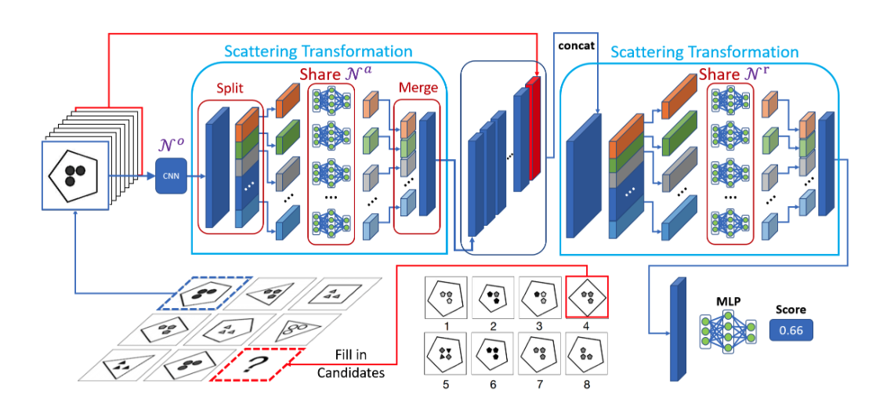
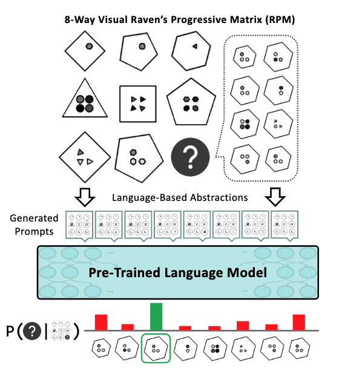
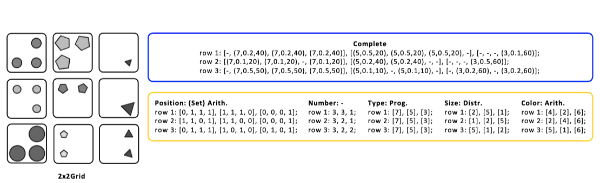
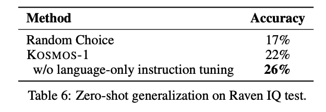

# Abstract Reasoning

*keywords: abstract reasoning, Raven's Progressive Matrices (RPM), abstrct visual reasoning*

Table of Content

- [Datasets](#datasets)
- [Learning Methods](#learning-methods)
- [Models](#models)
- [Representative works](#representative-works)

## Datasets

* Sandia matrices: a set of rules
* Synthetic RPMs: first-order logic
* D-Set and G-Set
* PGM: relation, object, attribute
* RAVEN: hierarchical structure (relation, attributes):

  > entity: type/shape, size, color
  > layout: number, position
  > component structure: L-R, U-D, O-IC, O-IG
  > relations: Constant, Progression, Arithmetic, Distribute Three
  >

  * I-RAVEN: -shortcut
  * RAVEN-FAIR: -bias

## Learning Methods

* supervised training
* auxiliary training
* contrastive training
* learning with an optimal trajectory
* data augmentation
* Disentangled representations, autoencoder
* unsupervised learning: pseudo label, pair-wise discriminator

## Models

* baselines: CNN, ResNet, LSTM
* relational reasoning：Relation Network
* hierarchical networks: panel, row, column, context

## Representative works

1. vision-based method

**The Scattering Compositional Learner: Discovering Objects, Attributes, Relationships in Analogical Reasoning**

learns a compositional hidden representation

* three types of neural networks: object network, attribute networks, relationship networks
* object network (object representation by CNN) -> attribute network (attribute features) -> relationship networks (determin whether certain relationships hold among attributes) -> output network

  
  <figcaption> SCL framework</figcaption>

<!-- 
*framework of SCL* -->

2. PLM

**In-Context Analogical Reasoning with Pre-Trained Language Models, ACL 2023, Umich**

encode visual RPM into language form (naming, decompose) + PLM

  
  <figcaption>overview of PLM for AR</figcaption>

* (entity-level, layout-level, component-level) convert RPM to text prompts
  * entity-level: type: number of sides, size: diameter decimal, color: shade
  * layout-level: number of obj. occupancy map
  * component-level: task -> prompt
* ZS-PLM

experiments: OPT, GPT3

  
  <figcaption>prompt case</figcaption>

3. LLM

**LLMs and the Abstraction and Reasoning Corpus: Successes, Failures, and the Importance of Object-based Representations**

summary:

* GPT4 can solve 13 out of 50 ARC tasks (textual encoding)
* object-based method matters

**Large Language Models Are Not Abstract Reasoners**

**summary: LLM struggle with abstrqct reasoning**

4. MLLM

**Language Is Not All You Need: Aligning Perception with Language Models**

  
  <figcaption>RAVEN IQ test results</figcaption>

4. others

**Abstract Visual Reasoning: An Algebraic Approach for Solving Raven’s Progressive Matrices**, CVPR 2023

*SOTA, algebra?*

INSIGHTS: not that insightful

## References

> Deep Learning Methods for Abstract Visual Reasoning: A Survey on Raven’s Progressive Matrices
>
> Multimodal Analogical Reasoning over Knowledge Graphs
